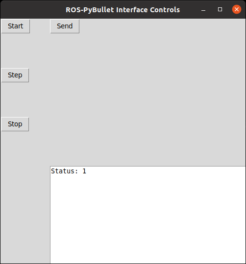
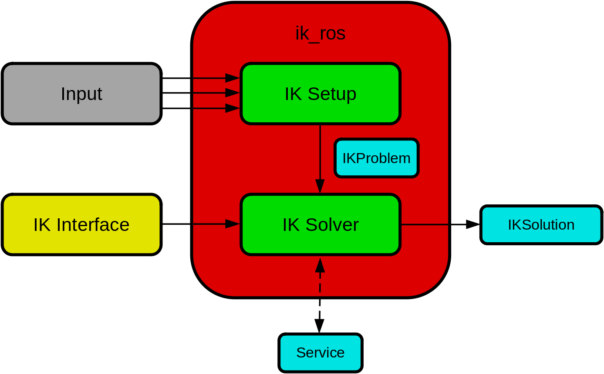

Additional Features
===================

GUI Controls
------------

The GUI controls can be used to perform basic interactions with the interface.
The following is an image of the GUI controls that you can expect to see when it is launched.

There are four buttons defined, and a text box. The effect of the buttons are as follows.

* *Start*: starts the simulation clock.
* *Step*: steps the simulation clock by the given sampling frequency specified in the :ref:`main configuration <mainconfig>`
* *Stop*: stops/pauses the simulation clock.
* *Send*: sends the robot to the initial configuration as specified in its configuration file. If the initial configuration is unpsecified then this defaults to zero.

The text box displays the status of the simulation. If it is ``1``, then the simulation is running. If it is ``0`` then the simulation is paused.
Ultimately, what is displayed here is reporting the current value of the ``rpbi/status`` topic with type ``std_msgs/Int64``.

Launch
******

Add the following to your launch file.

.. code-block:: xml

		<node pkg="rpbi_utils" name="controls" type="rpbi_controls_node.py" output="screen">
		  <rosparam param="config" file="path/to/config.yaml"/>
		</node>

Configuration
*************

The configuration for the GUI controls can be added to the :ref:`main yaml configuration <mainconfig>`.
An example is shown below.

.. code-block:: yaml

		controls:
		  robot_name: "ROBOT_NAME"

The ``robot_name`` tag should be the name of the robot as specified in the pybullet object configuration.
If the configuration is not given, then the *Send* button will have no effect.

Limitations and future development
**********************************

Currently, only a single robot is supported per node.
If you want to control multiple robots then you will need to launch multiple control nodes.

In the future we aim to re-implement the controls as an RQT pluggin. If you would like to contribute this please :ref:`submit a pull request <develop>`.

Interpolation
-------------

The interpolation interface provides the functions to generate smooth trajectories
based on a sequence of waypoints. Input is a 2D array of waypoints via a topic (default value is: ``ros_pybullet_interface/waypt_traj``).
Output is streamed as TF in /tf. The waypoints (input) are provided as a 2D [``Float64MultiArray``]
via a topic. The first row of the 2D array holds the relative time of the waypoints
and the rest of the rows are the dimensions of the waypoints. The columns of the 2D array
are the number of waypoints. The interpolation is typically used in the task space (can be modified to be used in the configuration space )
and provides linear, cubic interpolation for 1D, for euler angles (as 3 independent axis), for axis angle (1D around a specified axis),
and also for quaternions.

The process steps done in the node are:

1. Input process

   a. Read input (2D array) from topic ``ros_pybullet_interface/waypt_traj`` (it is suggested that this topic name is remaped)
   b. Input is a sequence of waypoints.
   
2. Interpolation process

   a. Interpolate each independent dimension separately and if there are coupled dimensions (e.g. quaternions) interpolate them jointly.
   b. Sample these interpolated functions with a frequency specified by ``[inter_dt]`` (see details on the parameter below)
   c. Store these samples in a list
   
3. Output process

   a. At a given frequency, specified by ``[consuming_freq]``, extract (and delete) the first from the list.
   b. Publish the extracted sample as TF to /tf with ``[header_frame_id]`` and ``[msg_child_frame_id]`` as specified below.

The interpolation node requires the following parameters to be set in the .launch file.

* ``[traj_config]`` [``str``] (required), specifies a yaml file which holds a number of parameters used for the interpolation.

* ``[consuming_freq]`` [``float``] (required), specifies the frequency of publishing the output (TF). In other words, how often a TF sample is published from the interpolated data.

input related parameters

* ``[motion_dimensions][number]`` [``int``] (required), specifies the number of dimensions of the waypoints.

input related parameters (linear task space dimensions)

* ``[motion_dimensions][trans][translation_x]`` [``float``] (optional), specifies a fixed value of the x dimension of the task motion.

* ``[motion_dimensions][trans][translation_x_index]`` [``int``] (optional), used if ``translation_x`` is empty and the index of the row where the x variable is held in the 2D array with the waypoints.

* ``[motion_dimensions][trans][translation_y]`` [``float``] (optional), specifies a fixed value of the y dimension of the task motion.

* ``[motion_dimensions][trans][translation_y_index]`` [``int``] (optional), used if ``translation_y`` is empty and the index of the row where the y variable is held in the 2D array with the waypoints.

* ``[motion_dimensions][trans][translation_z]`` [``float``] (optional), specifies a fixed value of the z dimension of the task motion.

* ``[motion_dimensions][trans][translation_z_index]`` [``int``] (optional), used if ``translation_z`` is empty and the index of the row where the z variable is held in the 2D array with the waypoints.

input related parameters (angular task space dimensions)

* ``[motion_dimensions][rotation][rotation_repr]`` [``str``] (optional),  options are: none, theta, quat, euler and it specifies the type of representation of the angular motion.

* ``[motion_dimensions][rotation][rotation_vec_index]`` [``list[int]``] with 1 (for theta) or 2 (for euler and quat) elements (required if theta or euler or quat), indicates the indexes of the row where the angular variables are held in the 2D array with the waypoints.

* ``[motion_dimensions][rotation][rotation_vec]`` [``list[int]``] with 3 elements (required if theta or none), specifies a fixed axis of rotation. Needs to be a normalized vector.

* ``[motion_dimensions][rotation][rotation_angle]`` [``float``] (required if none), a fixed value of the angle along the fixed axis of rotation of the task motion.

interpolation related parameters

* ``[interpolation][nochange_window_length]`` [``int``] (required), default value is 1. Advanced: specifies a window of samples that cannot be changed when new waypoints are received. It is used to ensure smoothness if the waypoints are changed on the fly.

* ``[interpolation][use_interpolation]`` [``bool``] (required), specifies whether the waypoints should be interpolated or not.

* ``[interpolation][inter_dt]`` [``float``] (required), specifies the dt between the interpolated points. In other words, frequency of the interpolation samples.

output related parameters

* ``[communication][publisher][header_frame_id]`` [``str``] (required), specifies header_frame_id of the TF streamed in /tf.

* ``[communication][publisher][msg_child_frame_id]`` [``str``] (required), specifies msg_child_frame_id of the TF streamed in /tf.

ik_ros
------

The `ik_ros <https://github.com/ros-pybullet/ik_ros>`_ package is a standardized interface for inverse kinematics using ROS.
Input data (e.g. end-effector task space goals) are directed to a problem setup node, that collects the information into a single message.
The setup node then publishes a problem message at a given frequency.
A solver node, that interfaces via a standardized plugin to an IK solver, then solves the problem and publishes the target joint state.

safe_robot
----------

A low-level `ROS package <https://github.com/ros-pybullet/safe_robot>`_ for the safe operation of robots.
Easily setup with a single launch file.
The ``safe_robot_node.py`` acts as a remapper.
Target joint states are passed through several safety checks, if safe then the command is sent to the robot, otherwise they are prevented.
Possible checks

* joint position limits
* joint velocity limits
* end-effector/link box limits
* self-collision check

custom_ros_tools
----------------

The `custom_ros_tools <https://github.com/ros-pybullet/custom_ros_tools>`_ package provides a collection of generic useful tools for ROS.
The package is extensively used in the ROS-PyBullet Interface.
