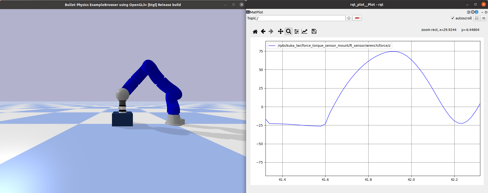
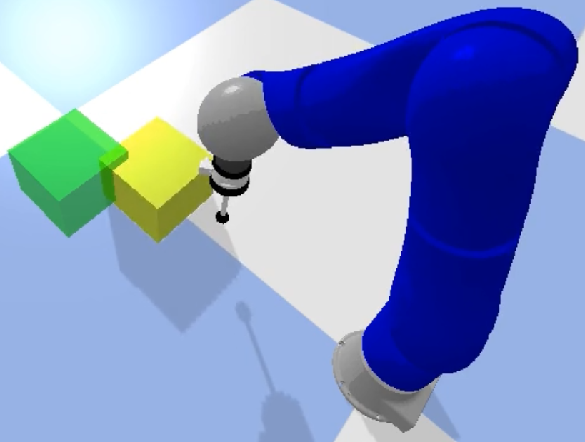
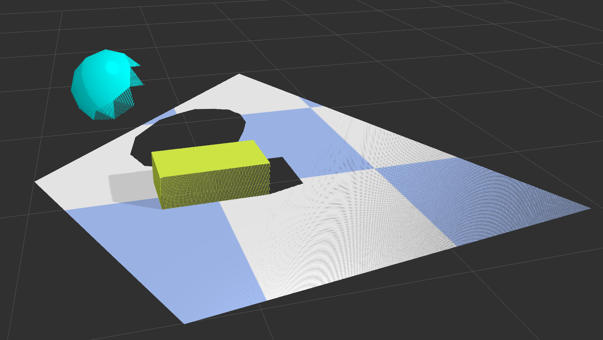
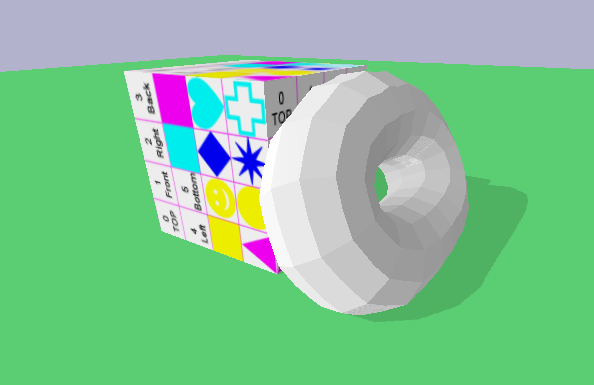

.. _examples:

Examples
========

The examples for the ROS-PyBullet Interface are collected in a dedicated ROS package `rpbi_examples <https://github.com/ros-pybullet/ros_pybullet_interface/tree/main/rpbi_examples>`_.
The following gives details for each example and shows how to run them.

Basic Examples
--------------

.. code-block::

   $ roslaunch basic_example_[NAME].launch

The basic examples simply demonstrate the current robots that can be loaded into PyBullet out-of-the-box.
Each example loads the given robot, and `a node <https://github.com/ros-pybullet/ros_pybullet_interface/blob/main/rpbi_examples/scripts/basic_robot_example_node.py>`_ that generates a standardized motion on the robot.
Some of the basic examples demonstrate different features of the library (e.g. recording a video, loading a URDF from the ROS parameter ``robot_description``).
The following list links to the launch file for all the currently available basic examples.

* `Kuka LWR <https://github.com/ros-pybullet/ros_pybullet_interface/blob/main/rpbi_examples/launch/basic_example_kuka_lwr.launch>`_
* `Talos <https://github.com/ros-pybullet/ros_pybullet_interface/blob/main/rpbi_examples/launch/basic_example_talos.launch>`_
* `Kinova <https://github.com/ros-pybullet/ros_pybullet_interface/blob/main/rpbi_examples/launch/basic_example_kinova.launch>`_
* `Human model <https://github.com/ros-pybullet/ros_pybullet_interface/blob/main/rpbi_examples/launch/basic_example_human_model.launch>`_
* `Nextage <https://github.com/ros-pybullet/ros_pybullet_interface/blob/main/rpbi_examples/launch/basic_example_nextage.launch>`_

*Note*, the Kuka LWR example additionally demonstrates how to start recording videos and also how to attach a Force-Torque sensor to a robot joint.  

Human Interaction
-----------------

.. code-block::

   $ roslaunch rpbi_examples human_interaction.launch

The goal of this example is to demonstrate how virtual forces, generated by the PyBullet simulator, can be rendered to the human via a haptic device.
We have integrated the `3D Systems Touch X Haptic Device <https://www.3dsystems.com/haptics-devices/touch-x>`_ into the framework, this is a necessary peice of hardware to run the example.
Ensure you connect your device and that it is setup by following the instructions in the `RViMLab/geomagic_touch_x_ros <https://github.com/RViMLab/geomagic_touch_x_ros>`_ repository.

When the example is launched, allow the haptic device to move to a nominal configuration.
After it is calibrated and initialized you will be able to move the device up and down.
The robot will track your movements in the z-axis until it reaches a block below the end-effector.
The forces detected from a Force-Torque sensor, attached to the robot wrist, is rendered as feedback to the user - you will be able to feel the reaction forces through the device.

Adding/removing PyBullet Objects Programmatically
-------------------------------------------------

.. image:: images/pybullet_objects.png
  :width: 400
  :alt: Alternative text

.. code-block::

   $ roslaunch rpbi_examples pybullet_objects_example.launch

Pybullet objects of all types can be specified in the launch file, or they can be added or removed programmatically (or even from the command line).
This example demonstrates the ability of the ROS-PyBullet Interface to handle different objects.
In this example,
a collision object is loaded (the floor),
a visual object is attached to a ``tf2`` frame moving in a figure-of-eight (the blue sphere), and
a dynamic object is programmatically added and removed (the yellow box).

Learning from demonstration and teleoperation
---------------------------------------------

.. code-block::

   $ roslaunch rpbi_examples lfd.launch

In this example, we demonstrate how to easily connect the ROS-PyBullet Interface with an external ROS library.
The goal of the task is for the robot to push the yellow box into the green goal.
When the example is launched, the robot is initialized.
You can interact with the demo using the keyboard - ensure the small window (the keyboard server) is in focus.
Press *key 1* to send the robot to the initial position.
Press *key 2* to start and stop teleoperation - when this is activated the robot states are being recorded (used as a demonstration to learn the DMP).
Press *key 3* once to learn the DMP from the demonstration, and then again to plan and execute motion using the learned DMP.
*Note*, the starting position for the DMP is always random.
	
RGBD Sensor
-----------

	
.. code-block::

   $ roslaunch rpbi_examples soft_body.launch		

In this example, we show how to setup an RGBD camera.
This can be attached to any ``tf2`` frame, i.e. it could be attached to a robot link, for example.
For this example, a similar scene is setup as in the pybullet objects example above.
However, in addition, we include an RGBD camera where the camera orbits the scene.
The projected point cloud is rendered in RVIZ as in the figure above.

Soft bodies
-----------

.. code-block::

   $ roslaunch rpbi_examples soft_body.launch	

This simple example demonstrates how soft bodies can be loaded into Pybullet.
In addition, this example highlights how to load objects using the ``PybulletURDF`` object type - this is for loading objects (not robots) from a URDF file.
The torus is a soft body, and the box and floor plane are loaded from URDF.
It is also possible to load soft bodies from a URDF.

